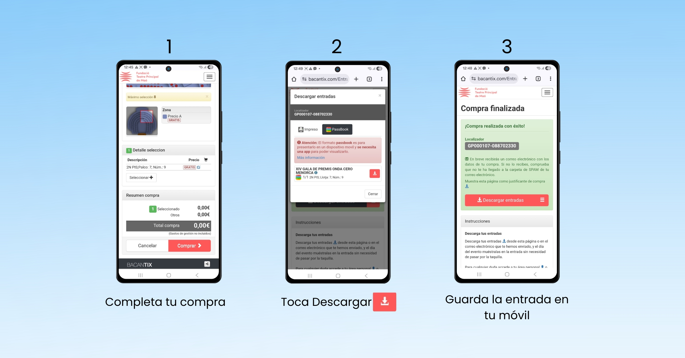
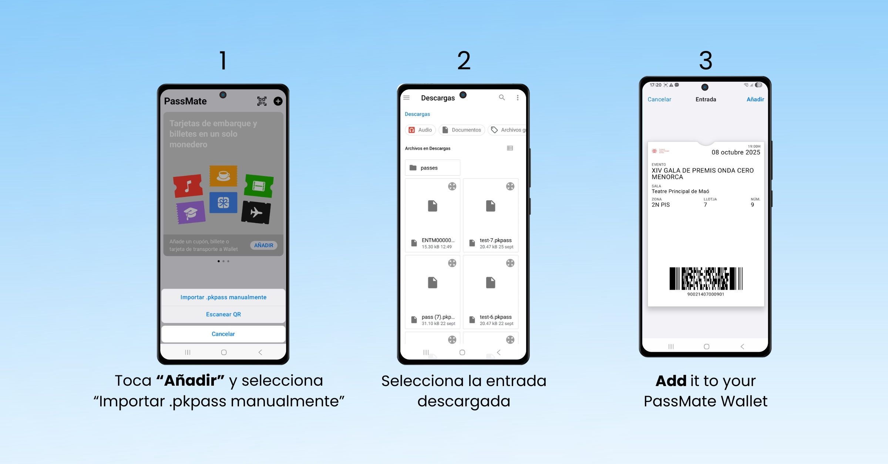

+++
title = "Cómo añadir tus entradas de Bacantix a la billetera"
date = 2025-10-07T17:40:00+03:00
description = "Descarga tus tickets de Bacantix y agrégalos fácilmente a PassMate Wallet."
+++
Cuando compras entradas a través de bacantix.com, puedes elegir descargar tus entradas directamente en tu teléfono en lugar de imprimirlas. Bacantix entrega las entradas digitales en formato Apple Wallet Passbook (.pkpass) — originalmente diseñado para usuarios de iPhone, pero también compatible con Android mediante **PassMate: Wallet for Passes**

**En iPhone:** las entradas se añaden automáticamente a la aplicación integrada Apple Wallet.
**En Android:** necesitas descargar PassMate: Wallet for Passes para abrir y añadir tus entradas de Bacantix — totalmente gratis.

##	Paso 1: Instalar PassMate: Wallet for Passes
Para ver y añadir tus entradas en Android, simplemente instala PassMate: Wallet for Passes, una aplicación gratuita que te permite abrir y organizar entradas Apple Wallet (.pkpass) en tu teléfono Android.

**Descarga PassMate en Android:**
[Google Play Store](https://play.google.com/store/apps/details?id=com.getpassmate.wallet)
[Huawei AppGallery](https://appgallery.huawei.com/app/C113344055)

##	Paso 2: Descargar tu entrada desde Bacantix
Después de completar tu compra, haz clic en el icono de descarga para guardar tu entrada de Bacantix (.pkpass) en tu teléfono Android.
Puedes descargar tu entrada:
*	Desde el correo de confirmación que recibes después de la compra
*	O directamente desde la página de confirmación de compra en Bacantix
Una vez descargada, la entrada (.pkpass) estará lista para abrirse con PassMate en tu teléfono Android.

##	Paso 3: Abrir tu entrada en PassMate
Abre la aplicación PassMate, toca Añadir, elige Importar .pkpass manualmente y selecciona tu entrada de Bacantix descargada.Tu entrada aparecerá al instante dentro de la aplicación — sin necesidad de imprimir ni buscar en tus correos.Muestra tu entrada digital en la entrada del evento para un acceso rápido y sin contacto.

##	La mejor alternativa a Apple Wallet para entradas en Android
PassMate: Wallet for Passes es una billetera digital gratuita para Android (sin anuncios ni suscripciones), disponible en Google Play y Huawei AppGallery.

**Permite a los usuarios:**
*	Abrir y usar entradas de Apple Wallet en Android
*	Recibir notificaciones basadas en hora y ubicación, igual que en Apple Wallet
*	Obtener actualizaciones del evento en tiempo real
*	Guardar todas las entradas y pases en una sola billetera digital, incluso sin conexión a internet
